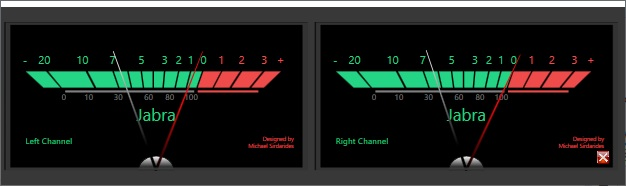

# VUMeter
Vintage VU Meter

Gray niddle shows the volume.

Red niddle shows the max point, when the sound is muted or no sound returns back to 0.

Left-Click everywhere in the window and drag it.

You can Resize it as you do with all windows.

When you you have more than one sound cards or audio outputs (like speakers, headphones, tv, ...), changing listening device will stop the app to listen, Right-Click everywhere in the window (except the exit button!) to get the new default audio output source and the app will listen on this device.

To exit press Right-Click on the exit button at the right bottom corner, left button does not working because as said before left-click is for draging!

Do not forget to copy CoreAudioApi.dll in the bin folder.  Remember this file should be with the VUMeter.exe file.  

